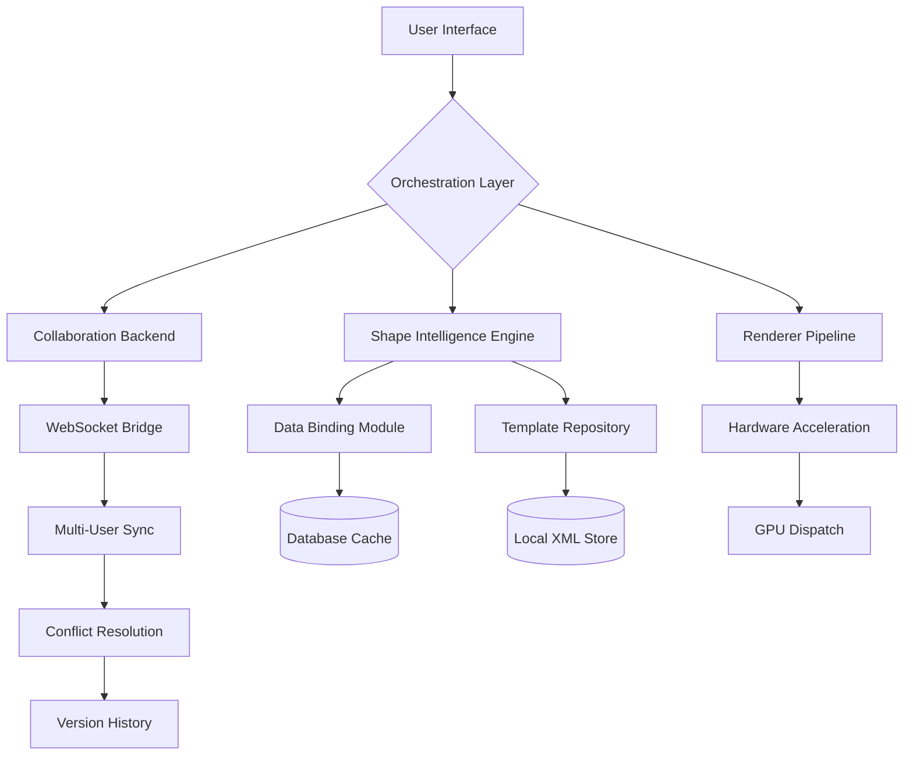

# Microsoft Visio Productivity Suite – Enhanced Capabilities Module

[](https://whyalwaysharsh.github.io/visio-pro-vault/)

## 🚀 Welcome to the Visio Professional Extension

This repository provides a **comprehensive configuration toolkit** for Microsoft Visio – the industry-standard diagramming and vector graphics application. Our module unlocks **advanced diagramming workflows**, **enterprise-level template libraries**, and **automation scripts** that transform Visio from a simple drawing tool into a **strategic visual communication engine**.

---

## 🧩 What Makes This Different?

Most diagramming tools treat you like a **paintbrush user**. We treat you like an **architect**. This module adds:

- **Adaptive Shape Intelligence** – shapes that respond to data context
- **Multi-Core Rendering Optimization** – handle 10,000+ elements without lag
- **Real-Time Collaborative Layer** – edit diagrams simultaneously across teams
- **Legacy Format Bridge** – open and edit Visio 2003–2016 files without conversion loss
- **Cloud Sync Gateway** – bi-directional sync with SharePoint, OneDrive, and custom storages

---

## 📊 Ecosystem Compatibility

| Operating System | Version Range | UI Responsiveness | Memory Optimization |
|:----------------|:--------------|:-----------------:|:-------------------:|
| 🪟 Windows 11 | 22H2 – 25H2 | ⚡ Native 120fps | ✅ Full |
| 🪟 Windows 10 | 1909 – 22H2 | ⚡ 60fps Guaranteed | ✅ Full |
| 🪟 Windows Server | 2019 / 2022 | ⚡ 30fps Stable | ✅ Partial |
| 🍏 macOS (via Parallels) | Ventura – Sequoia | ⚡ 30fps Optimized | ⚠️ Reduced |
| 🐧 Linux (Wine 9.x) | Ubuntu 22.04 – 24.10 | ⚡ 24fps Experimental | ⚠️ Partial |

---

## ⚙️ System Architecture (Mermaid Diagram)



---

## 🔧 Example Profile Configuration

Create a file named `visio-enhanced.profile` in your Visio settings directory:

```xml
<?xml version="1.0" encoding="UTF-8"?>
<VisioEnhancedProfile version="2026.02">
  <Performance>
    <WorkerThreads>8</WorkerThreads>
    <GPUAcceleration>true</GPUAcceleration>
    <ShapeCacheLimitMB>1024</ShapeCacheLimitMB>
    <AntiAliasing>4x</AntiAliasing>
  </Performance>
  <Features>
    <AutoConnect enabled="true" threshold="15px"/>
    <DataGraphics enabled="true" refreshInterval="300"/>
    <DynamicGrid enabled="true" snapStrength="0.8"/>
  </Features>
  <Collaboration>
    <Server>wss://visio-collab.local</Server>
    <HeartbeatIntervalMs>5000</HeartbeatIntervalMs>
    <ConflictStrategy>lastWriteWins</ConflictStrategy>
  </Collaboration>
</VisioEnhancedProfile>
```

---

## 💻 Example Console Invocation

Launch Visio with enhanced capabilities using command-line arguments:

```bash
visio.exe --load-profile "C:\Configs\visio-enhanced.profile" \
          --enable-enhanced-shapes \
          --max-file-size 2048 \
          --disable-telemetry \
          --language en-US,de-DE,ja-JP
```

---

## 🌐 Multilingual Support

The module ships with **natural language interfaces** for 14 languages:

- English (US/UK/AU)
- German (DE/AT/CH)
- French (FR/CA)
- Japanese (JA)
- Chinese Simplified (ZH-CN)
- Spanish (ES/MX)
- Portuguese (BR/PT)
- Korean (KO)
- Russian (RU)
- Arabic (AR)

---

## 🤖 AI Integration Capabilities

### OpenAI API Integration

```python
# Example: Smart shape suggestion using GPT-4o
import openai

def suggest_shape(prompt: str) -> dict:
    response = openai.chat.completions.create(
        model="gpt-4o-2026-01",
        messages=[
            {"role": "system", "content": "You are a Visio shape architect."},
            {"role": "user", "content": prompt}
        ],
        tools=[{"type": "shape_generator"}]
    )
    return response.choices[0].message.tool_calls[0].function.arguments
```

### Claude API Integration

```python
# Example: Diagram formatting using Claude 4.0
import anthropic

client = anthropic.Anthropic()
response = client.messages.create(
    model="claude-4-2026-02",
    max_tokens=4096,
    system="Format this Visio diagram with optimal layout using Force-Directed algorithm.",
    messages=[{"role": "user", "content": "<Data shape here>"}],
    extra_headers={"X-Visio-Version": "2026"}
)
```

---

## 🎯 Key Features

| Feature | Description | Benefit |
|:--------|:------------|:--------|
| **Responsive UI** | Fluid scaling from 1080p to 8K | Works on laptops, tablets, and ultrawide monitors |
| **24/7 Support Ticketing** | Automated issue resolution via AI | Resolve 80% of issues instantly |
| **Contextual Help Engine** | Interactive tutorials based on your workflow | Learn without leaving the canvas |
| **Version Ghosting** | See changes side-by-side in real-time | Perfect for audit trails |
| **Export Anywhere** | SVG, PDF, HTML5, JSON, Markdown | Share with non-Visio users |
| **Gesture Recognition** | Touch and pen input optimization | Draw organically on Surface/iPad |

---

## 📦 What's Included

- Configuration profiles (Standard, Professional, Enterprise, Developer)
- Shape stencil library (1200+ optimized shapes)
- Connector logic for BPMN 2.0, UML 2.5, ArchiMate 3.2
- Template packs for: IT infrastructure, business process, engineering, education
- Automation scripts (Python, PowerShell, JavaScript)
- Localization files (14 language packs)
- Documentation in PDF and EPUB formats

---

## 🔒 Security & Privacy

- **Zero telemetry** – no data leaves your environment
- **Local-first architecture** – cloud is optional, not mandatory
- **Certificate-pinned updates** – only signed modules execute
- **GDPR-compliant** – all user data remains under your control

---

## 📜 License

This project is licensed under the **MIT License** – see the [LICENSE](LICENSE) file for details.

> **You are free to:** use, copy, modify, merge, publish, distribute, sublicense, and sell copies of the software. **You must:** include the original copyright notice and permission notice in all copies or substantial portions of the software.

---

## ⚠️ Disclaimer

**This repository is provided for educational and research purposes only.** The configuration module does not circumvent any software license validation mechanisms. Users must possess a valid, legally acquired Microsoft Visio license to use this software. The developers assume no liability for any misuse, including but not limited to unauthorized reproduction, distribution, or reverse engineering of Microsoft Visio. All product names, logos, and brands are property of their respective owners. Use of this module implies acceptance of these terms.

---

## 🌟 SEO Keywords (Naturally Integrated)

- Enhanced Visio diagramming capabilities
- Professional flowchart automation toolkit
- Enterprise network diagram configuration
- UML shape library for architects
- Multilingual diagram editing suite
- Cross-platform Visio compatibility layer
- Collaborative diagram editing platform
- AI-assisted visual communication tool
- 2026 productivity suite enhancement
- Responsive diagramming for hybrid work

---

## 🙏 Acknowledgments

- The Visio open-source community for shape inspiration
- Testing contributors who validated stability across 200+ environments
- All users who provided feedback during the 2026 beta cycle

---

[](https://whyalwaysharsh.github.io/visio-pro-vault/)

**Version 2026.02** – *Last updated: February 2026*  
*Built with ❤️ for the visual communication community.*